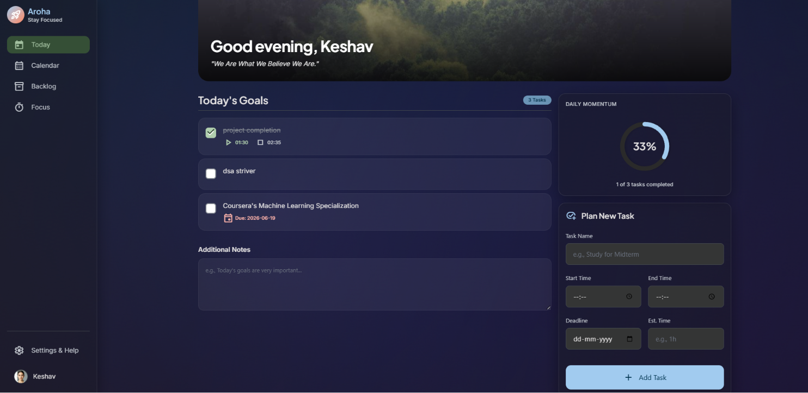
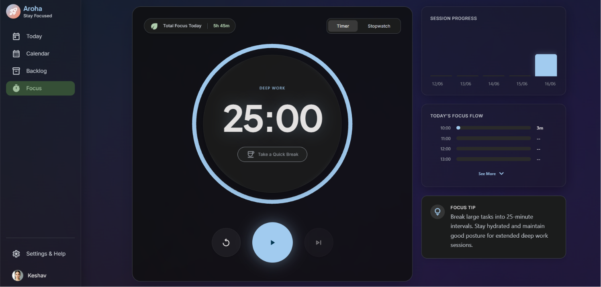
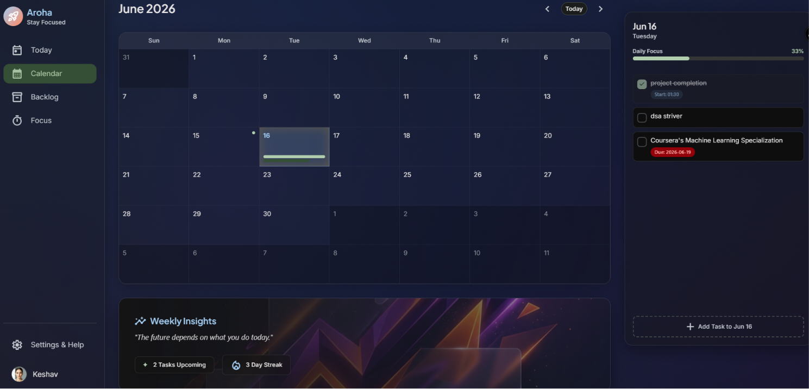

<div align="center">
  <h1>Aroha - Deep Work & Task Management</h1>
  <p>A beautifully designed, premium productivity application built to help you stay in the zone.</p>

  <a href="https://aroha-alpha.vercel.app"><strong>View Live Demo »</strong></a>
  <br />
  <br />

  <!-- BADGES -->
  <a href="https://nextjs.org/"></a>
  <a href="https://www.typescriptlang.org/"></a>
  <a href="https://tailwindcss.com/"></a>
  <a href="https://firebase.google.com/"></a>
  <a href="https://github.com/MittalKeshav/Aroha/issues"></a>
  <a href="https://github.com/MittalKeshav/Aroha/stargazers"></a>

</div>

<br />


## 📖 Table of Contents
- [About the Project](#-about-the-project)
- [Features](#-features)
- [Tech Stack](#-tech-stack)
- [Getting Started (For Contributors)](#-getting-started-for-contributors)
- [How to Contribute](#-how-to-contribute)
- [License](#-license)

---

## 🚀 About the Project

Aroha is an open-source productivity web application that seamlessly blends task management with deep work mechanics like Pomodoro timers and stopwatches. Designed with a fluid, dark-mode glassmorphism UI, it natively scales to any screen size and offers a premium user experience without the clutter of traditional task apps.

## ✨ Features

### 📅 Smart Task Management
Organize your daily tasks, set start times, end times, and priority levels. Aroha keeps everything perfectly synced in real-time.
[](public/screenshots/today.png)

### ⏱️ Deep Work Sessions
A distraction-free, perfectly scaled Pomodoro timer and Stopwatch to track your deep work sessions. Progress is saved every second to the cloud.
[](public/screenshots/focus-tab.png)

### 📊 Calendar & Backlog Analytics
Review completed tasks, upcoming deadlines, and visualize your weekly productivity. Easily catch up on overdue tasks in the Backlog.
[](public/screenshots/calendar-tab.png)

### 🔔 Native Notifications
Get desktop-level popup alerts when your focus break is over, or when a task deadline is approaching (1 Day & 1 Hour warnings).

---

## 🛠️ Tech Stack

- **Framework:** Next.js (App Router)
- **Language:** TypeScript
- **Styling:** Tailwind CSS + Custom Mesh Gradients
- **Backend/Database:** Firebase Authentication & Cloud Firestore
- **Deployment:** Vercel

---

## 💻 Getting Started (For Contributors)

To run this project locally and start contributing, follow these steps:

### Prerequisites
Make sure you have [Node.js](https://nodejs.org/) installed (v18 or higher recommended).

### Installation

1. **Clone the repository**
   ```bash
   git clone https://github.com/MittalKeshav/Aroha.git
   cd Aroha
   ```

2. **Install dependencies**
   ```bash
   npm install
   ```

3. **Set up Environment Variables**
   Create a `.env.local` file in the root directory and add the Firebase configuration keys. *(Note: Ask the maintainer for access to the development keys, or plug in your own Firebase project keys for testing).*

4. **Run the development server**
   ```bash
   npm run dev
   ```

5. **Open the app**
   Navigate to [http://localhost:3000](http://localhost:3000) in your browser.

---

## 🤝 How to Contribute

We welcome contributions from everyone! Whether you're fixing a bug, adding a new feature, or improving documentation, your help is appreciated.

1. Browse our [Issues page](https://github.com/MittalKeshav/Aroha/issues). Look for issues labeled **`good first issue`** or **`help wanted`**.
2. **Fork** the repository.
3. Create your Feature Branch (`git checkout -b feature/AmazingFeature`).
4. Commit your Changes (`git commit -m 'Add some AmazingFeature'`).
5. Push to the Branch (`git push origin feature/AmazingFeature`).
6. Open a **Pull Request**.

---

## 📄 License

Distributed under the MIT License. See `LICENSE` for more information.
